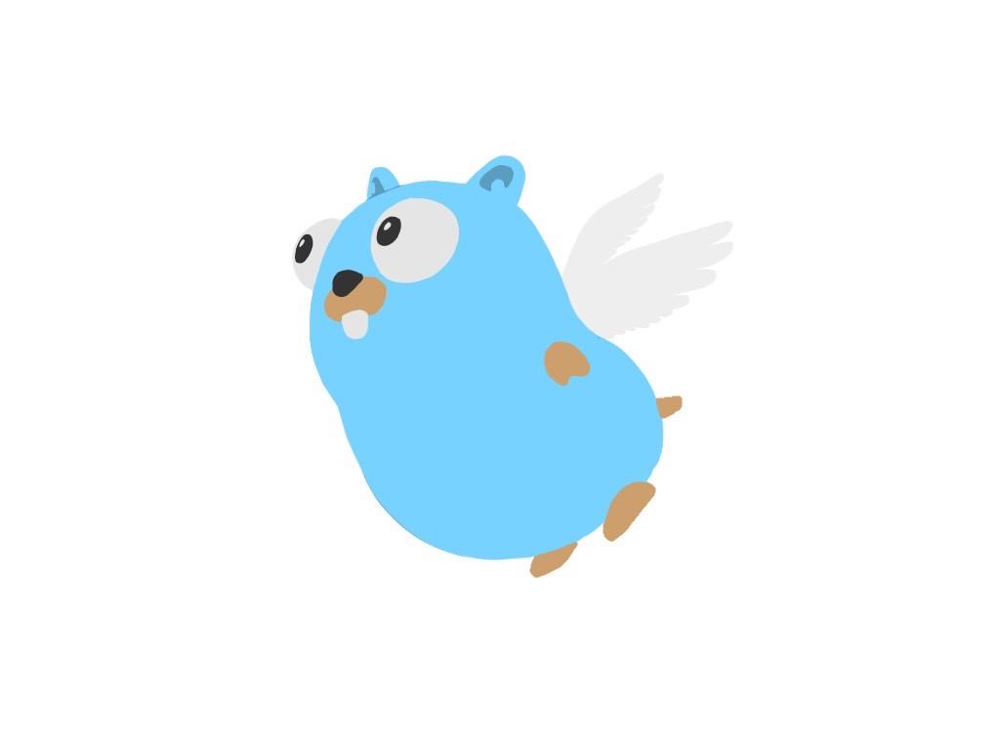

# boids algorithm with Go and WebAssembly

## 概要

https://github.com/hamao0820/goidsをwebで遊べるようにwasmを使って移植しました。

## 遊び方

https://hamao0820.github.io/goids-wasm/

で遊べます。マウスを避けるように動きます。また、クリックすることで gopher くんの数を増やせます。

次の URL パラメータを指定することができます。

| パラメータ | 説明                                          |
| :--------: | --------------------------------------------- |
|    num     | gopher くんの数(int)(default: 30)             |
|   speed    | 最大のスピード(float)(default: 4)             |
|   force    | 力のベクトルの最大の大きさ(float)(default: 2) |
|   sight    | 視野の範囲(float)(default: 100)               |
